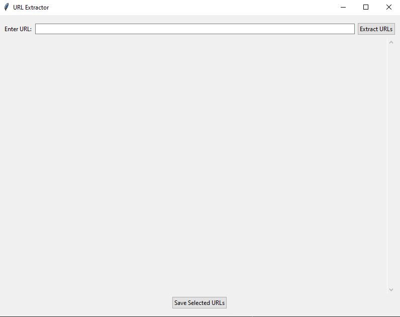

# Web to PDF Toolkit

A single, modern desktop app that extracts URLs from web pages and converts them to PDFs. Built with `tkinter` for a lightweight GUI and Playwright for reliable rendering.

## Highlights
- One app with two workflows: extract links and convert pages to PDFs.
- Send selected links directly from the extractor to the converter queue.
- Headless or visible browser mode.
- Retry handling with partial saves on failures.
- Clipboard paste, import/export, and deduping.

## Features
- URL extraction with optional same-domain filtering.
- Multi-select results, copy, save, or push to converter.
- Batch PDF conversion with progress and log output.
- Output folder auto-open on completion (optional).

## Screenshots
Screenshots are being updated to reflect the new unified UI.




## Installation

1. Clone the repository

```bash
git clone https://github.com/yourusername/webtopdf.git
cd webtopdf
```

2. Create and activate a virtual environment

```bash
python -m venv venv
source venv/bin/activate  # Windows: venv\Scripts\activate
```

3. Install dependencies

```bash
pip install -r requirements.txt
python -m playwright install
```

## Usage

Run the unified app:

```bash
python app.py
```

Optional legacy entry points (open a specific tab):

```bash
python url_extractor.py
python webpage_to_pdf.py
```

### Extract URLs
1. Enter a webpage URL and select your filters.
2. Click "Extract Links".
3. Select links and copy, save, or send to the converter.

### Convert to PDF
1. Add URLs manually, paste, or import a `.txt` file.
2. Choose an output directory.
3. Configure headless mode and retries.
4. Click "Start Conversion".

## Quality (ISO/IEC 25010 Focus)
- Functional suitability: clear separation of extract vs. convert workflows.
- Usability: guided layout, consistent actions, and status feedback.
- Reliability: retries, partial saves, and defensive error handling.
- Performance efficiency: background workers keep the UI responsive.
- Maintainability: unified app structure and shared utilities.
- Portability: runs on Windows, macOS, and Linux with Python + Playwright.

## Project Structure
```
.
├── app.py               # Unified GUI app
├── url_extractor.py     # Optional launcher (opens Extract tab)
├── webpage_to_pdf.py    # Optional launcher (opens Convert tab)
├── requirements.txt
├── images/
└── README.md
```

## Notes
- Make sure Playwright browsers are installed:
  `python -m playwright install`
- Some pages may require authentication or block headless browsers.
- Filenames are sanitized and truncated to avoid OS path issues.
- To set a custom app icon, place `app.ico` in `assets/`.

## License
MIT License

## Contributing
Issues and pull requests are welcome.
