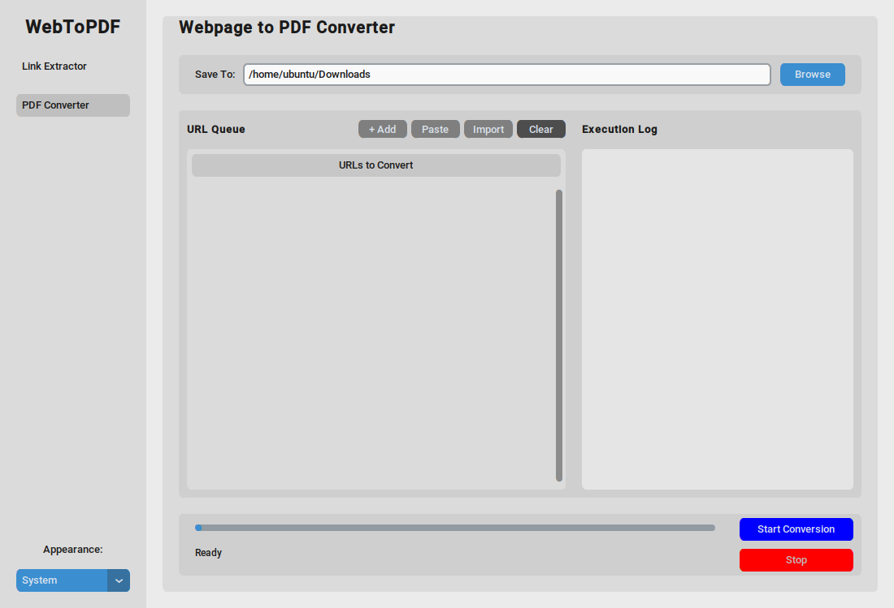

# 🧰 GUI Toolkit: URL Extractor & Webpage to PDF Converter

This repository includes **two standalone Python GUI applications** built with `tkinter`:

1. 🔗 **URL Extractor** – Extracts all hyperlinks from a given webpage and allows you to save selected links.
2. 🖨️ **Webpage to PDF Converter** – Converts a list of URLs into PDF files using a headless Chromium browser powered by [Playwright](https://playwright.dev/).

---

## 📦 Features

### 🔗 URL Extractor
- Enter any valid `http://` or `https://` URL.
- Automatically fetches and lists all anchor links (`<a href=...>`).
- Lets you select which links to save.
- Save selected URLs to a `.txt` file.

### 🖨️ Webpage to PDF Converter
- Input URLs manually or import from a `.txt` file.
- Converts pages to PDF using Playwright (headless Chromium).
- Retries failed attempts automatically (configurable).
- Logs status, errors, and progress.
- Automatically sanitizes filenames from page titles.
- Partial saves supported if page load fails.

---

## 📷 Screenshots




---

## 🛠️ Installation

### 1. Clone the repository

```bash
git clone https://github.com/yourusername/url-extractor-pdf-converter.git
cd url-extractor-pdf-converter
````

### 2. Set up the environment

```bash
python -m venv venv
source venv/bin/activate  # or venv\Scripts\activate on Windows
```

### 3. Install dependencies

```bash
pip install -r requirements.txt
python -m playwright install
```

---

## 🧾 Dependencies

* `tkinter` (comes with Python)
* `requests`
* `beautifulsoup4`
* `playwright`

You can install them manually with:

```bash
pip install requests beautifulsoup4 playwright
python -m playwright install
```

---

## 🚀 Usage

### Run URL Extractor

```bash
python url_extractor.py
```

### Run Webpage to PDF Converter

```bash
python webtopdf.py
```

---

## 📁 Directory Structure

```
.
├── url_extractor.py       # GUI app to extract and save hyperlinks
├── webtopdf.py            # GUI app to convert webpages to PDF
├── README.md              # You're here
├── requirements.txt       # List of dependencies
```

---

## 📌 Notes

* Make sure Playwright is installed properly:
  `python -m playwright install`
* For URL Extractor, malformed or broken links may result in errors.
* PDF filenames are sanitized and truncated to avoid OS file path issues.

---

## 📄 License

MIT License

---

## 🤝 Contributing

Pull requests and issues are welcome!

